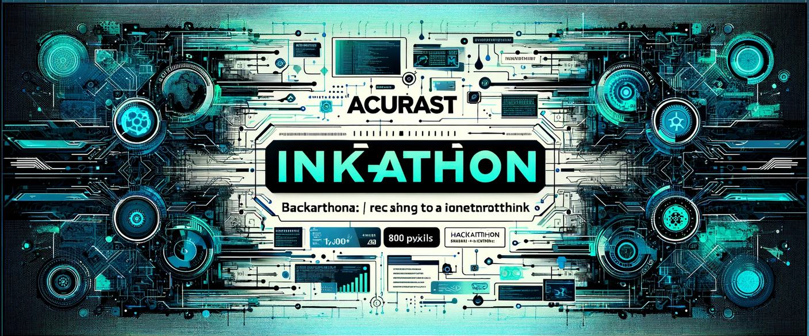

# Acurast ink!athon dApp

This is a full-stack dApp that uses the ink!athon boilerplate for the frontend, and connects it to Acurast using an ink! smart contract. It showcases the ease of use of Acurast, and leverages ink!athon to develop this quick and easily.

The project is created for the Polkadot X Encode 2024 Hackathon.

## Hackathon bounties

This project is applying for the following bounty categories:

- Best use of Polkadot
- First steps Challenge (based on _Start building dApps on ink! workshop_)
- No-code Oracle onboarding experience
- Best application leveraging Acurast’s compute

## Links

- [Video demo]()
- [Vercel deployment]()

## Our Contributors ✨

